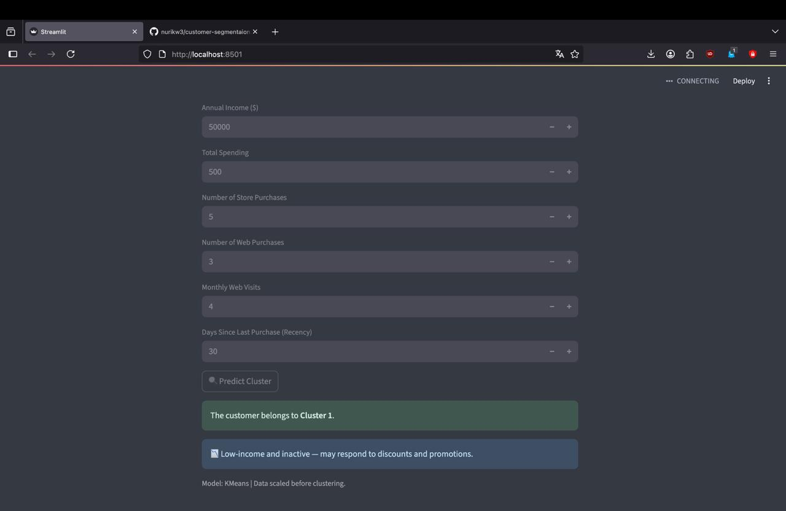
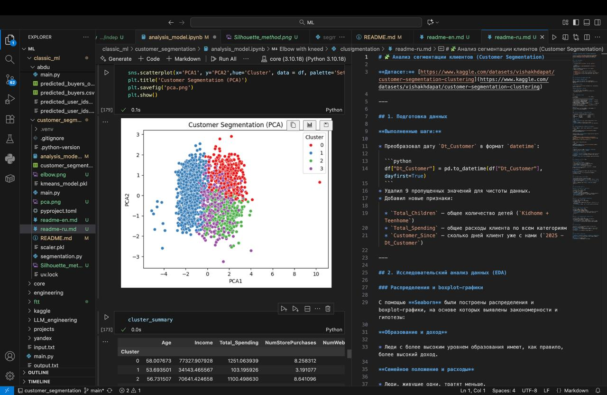
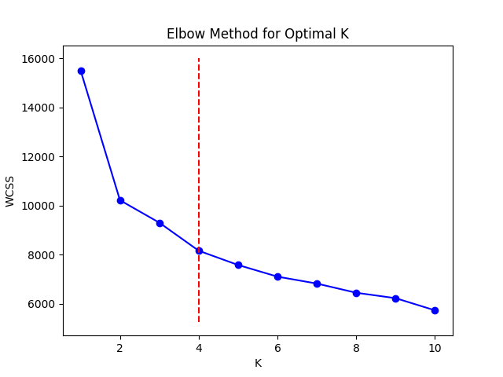
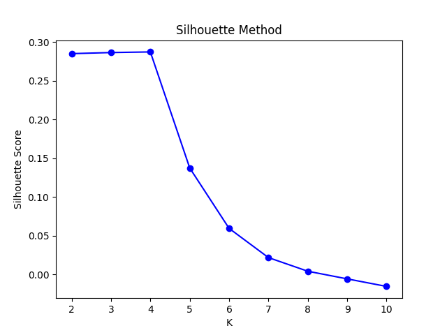
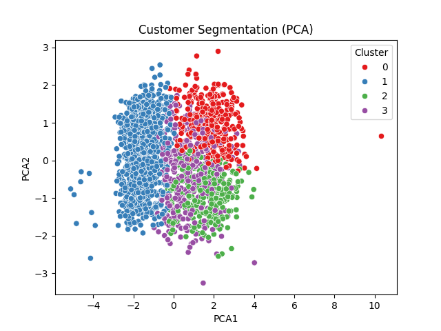

# 🧩 Customer Segmentation Analysis

**Dataset:** [https://www.kaggle.com/datasets/vishakhdapat/customer-segmentation-clustering](https://www.kaggle.com/datasets/vishakhdapat/customer-segmentation-clustering)

---

## 📸 Project Preview

|       Streamlit Interface      |    Development Process    |
| :----------------------------: | :-----------------------: |
|  |  |

---

## 1. Data Preparation

**Steps performed:**

Converted the column `Dt_Customer` to datetime format:

```python
df["Dt_Customer"] = pd.to_datetime(df["Dt_Customer"], dayfirst=True)
```

* Removed 9 missing values to keep the dataset clean.
* Added new features:

  * `Total_Children` — total number of children (`Kidhome + Teenhome`)
  * `Total_Spending` — total spending across all product categories
  * `Customer_Since` — number of days since becoming a customer (`2025 - Dt_Customer`)

---

## 2. Exploratory Data Analysis (EDA)

### Distribution and Boxplots

Using **Seaborn**, several distribution and boxplot graphs were created to identify relationships and patterns.

**Education and Income**

* People with higher education tend to have higher income.

**Marital Status and Spending**

* People living alone tend to spend less.
  This could be an important behavioral feature for segmentation.

---

### Correlation Matrix

| Variables                           | Correlation | Interpretation                                  |
| ----------------------------------- | ----------- | ----------------------------------------------- |
| Total_Spending ↔ NumStorePurchases  | **0.68**    | Most spending happens in physical stores.       |
| Total_Spending ↔ NumWebPurchases    | **0.53**    | Active buyers purchase both online and offline. |
| NumStorePurchases ↔ NumWebPurchases | **0.52**    | Customers use multiple shopping channels.       |
| Age ↔ Other variables               | ~0.11–0.16  | Age has little effect on customer behavior.     |

**Conclusion:**
Active customers buy across multiple channels — they’re loyal and engaged.

---

### Income by Education and Marital Status

| Education  | Marital Status | Avg Income |
| ---------- | -------------- | ---------- |
| PhD        | Married        | 79,244     |
| Graduation | Married        | 64,176     |
| PhD        | Together       | 64,176     |

**Observations:**

* Customers with **Graduation** have the highest average income.
* **PhD** holders consistently maintain high income levels.
* **Basic education** corresponds to the lowest income (2–3x lower).

---

## 3. Feature Engineering

Created a group of average spending by education level:

```python
group1 = df.groupby("Education")["Total_Spending"].mean().sort_values(ascending=False)
```

Added the **TotalAccepted** feature — total number of accepted marketing campaigns:

```python
df["TotalAccepted"] = df[["AcceptedCmp1","AcceptedCmp2","AcceptedCmp3","AcceptedCmp4","AcceptedCmp5","Response"]].sum(axis=1)
df["AcceptedAny"] = df["TotalAccepted"] > 0
```

Grouped by marital status:

```python
group2 = df.groupby("Marital_Status")["AcceptedAny"].mean().sort_values(ascending=False)
```

**Insights:**

* Most responsive groups: **Together**, **Married**
* Least responsive: **Alone**, **Widow**

**Marketing Recommendations:**

* **Together / Married** — family discounts, loyalty programs
* **Divorced / Single** — personalized offers, individual campaigns
* **Alone / Widow** — simple communication and basic discounts

---

## 4. Age Group Analysis

**Detected pattern:**

* Income grows almost linearly with age.
* Income peaks at **70+ years**, not 40–50 as typically expected.
* Young customers (18–29) show the lowest income levels.
* **60+** customers are the most solvent group.

**Possible reasons:** accumulated wealth, inheritance, or product focus on mature audiences.

**Recommendations:**

* **50+ years:** premium products, personal services, loyalty rewards.
* **18–39 years:** installment plans, educational marketing, youth discounts.

---

## 5. Scaling and Clustering

* All numerical features were standardized.
* Optimal cluster count determined using **Elbow Method** and validated by **Silhouette Score** — chosen **k = 4**.

| Method                      |             Visualization            |
| :-------------------------- | :----------------------------------: |
| Elbow Method                |                   |
| Silhouette Score            |  |
| PCA (Cluster visualization) |                       |

---

## 6. Cluster Interpretation

### 🟢 Cluster 0 — “Wealthy but Inactive”

* 💰 Income: 77K | Spending: 1250
* 👴 Avg Age: ~58
* 🛒 Prefer offline shopping
* 📅 Recency = 70 (haven’t purchased recently)

**Insight:** Wealthy older clients with low activity.
**Action:** Reactivation campaigns — reminders, bonuses, re-engagement offers.

---

### 🔴 Cluster 1 — “Low-Income and Inactive”

* 💰 Income: 34K | Spending: 103
* 🛒 Low activity across all channels
* 📅 Recency = 49

**Insight:** Low purchasing power but potential interest.
**Action:** Discounts, installment plans, personalized promotions.

---

### 🟢 Cluster 2 — “Loyal and Active”

* 💰 Income: 70K | Spending: 1100
* 🛒 Frequent online and offline purchases
* 📅 Recency = 18.9 (recently purchased)

**Insight:** Ideal customers — rich, active, and loyal.
**Action:** VIP programs, loyalty rewards, retention campaigns.

---

### 🟠 Cluster 3 — “Digitally Active Mid-Tier”

* 💰 Income: 57K | Spending: 811
* 🌐 High online activity (7.6 web purchases, 6.6 visits)
* 📅 Recency = 55 (activity declining)

**Insight:** Digitally oriented customers losing engagement.
**Action:** Remarketing and personalized email campaigns.

---

## 7. Final Overview

| Cluster | Description               | Priority  | Action Plan           |
| :------ | :------------------------ | :-------- | :-------------------- |
| 🟢 2    | Loyal and active          | 🔝 High   | Retention and rewards |
| 🔵 0    | Wealthy but inactive      | 🟡 Medium | Reactivation          |
| 🟠 3    | Digitally active mid-tier | 🟠 Medium | Remarketing campaigns |
| 🔴 1    | Low-income and inactive   | 🔴 Low    | Minimal promotions    |

---

## 8. Tools & Libraries

* **Python**
* **Pandas**, **NumPy**
* **Seaborn**, **Matplotlib**
* **Scikit-learn** — KMeans, StandardScaler, PCA
* **Joblib** — model saving
* **Streamlit** — interactive dashboard

Would you like me to make a short professional English version too (for your GitHub repo front page, e.g. a 1-paragraph “project summary” above the details)? It makes the project look very polished.
